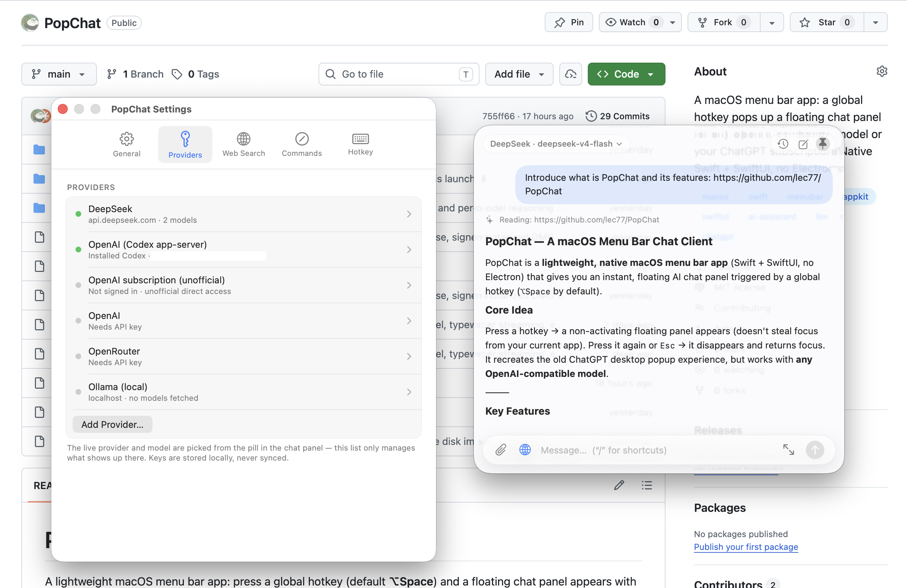

# PopChat

[](LICENSE)


A mini AI chat app for quick, small (and usually temporary) chats — the kind that don't need a frontier model, so it pairs nicely with lighter, locally-run ones.

Press a global hotkey (default **⌥Space**) and a floating chat panel appears with the input already focused. Pin it if you want to keep the messages as a reference for your other work.

<p align="center"></p>


## Features

- **Instant panel** — a non-activating `NSPanel`, so showing it never steals focus from the app underneath and dismissing it returns focus immediately. Remembers where you last dragged it. ⌘P pins it open.
- **Any OpenAI-compatible provider** — OpenAI, OpenRouter, or any custom endpoint, plus local models via Ollama or LM Studio (no API key needed). Switch provider and model from a pill in the panel header.
- **Slash commands** — your own prompt templates with a `{input}` placeholder and an autocomplete popup when the draft starts with `/`.
- **Large editor** (⌘E) — the input capsule morphs into a full draft editor; ⌘↩ sends.
- **Liquid-glass look** on macOS 26 (translucent panel with an adjustable tint), a solid fallback below that, Light/Dark/Auto appearance, four accent presets plus a custom color picker, and full support for Reduce Motion / Reduce Transparency.

## Install

Download the latest `PopChat-x.y.z.dmg` from [Releases](https://github.com/lec77/PopChat/releases), open it, and drag PopChat to Applications.

Requires **macOS 14 or later**. The liquid-glass backdrop needs macOS 26; older systems get a solid panel.

## Build from source

Needs a Swift toolchain — Xcode, or just the Command Line Tools (`xcode-select --install`).

```sh
git clone https://github.com/lec77/PopChat.git
cd PopChat
./build.sh              # release build → dist/PopChat.app
open dist/PopChat.app
```

`./build.sh debug` builds the debug configuration. The script wraps the SwiftPM binary in an app bundle and **ad-hoc signs** it, which is fine for a build you made yourself. `./release.sh` is the other path — it signs with a Developer ID, builds the disk image, and notarizes it; that one only works with my certificate.

There is no Xcode project — it's plain SwiftPM (`Package.swift`) plus `build.sh`.

## Setup

Open Settings from the menu bar icon or **⌘,** inside the panel.

- **Providers** — pick a preset or add a custom OpenAI-compatible endpoint, paste an API key, and fetch the model list. ChatGPT-subscription access has two separate presets:
    - *OpenAI (Codex app-server)*: preferred. You must install and update Codex yourself, run `codex login` in Terminal, and ensure PopChat can find the `codex` executable (an explicit path field is available). PopChat only starts the local app-server; it does not install Codex or own/copy its login.
    - *OpenAI subscription (unofficial)*: the existing direct OAuth flow. It opens your browser and needs port 1455 during sign-in. Because it calls a backend not documented for third-party apps, it may break and may carry account or terms risk.
- **Web Search** — choose the engine; Tavily/Brave need keys, DuckDuckGo doesn't.
- **Commands** — edit the system prompt and define slash commands.
- **Hotkey** — record whatever global shortcut you want (⌥Space by default).

Local models need no key at all: run Ollama and pick its preset, or point a custom endpoint at LM Studio's server.

### Where things are stored

| What | Where |
| --- | --- |
| Providers, models, preferences | `UserDefaults` (`com.chenle.PopChat`) |
| API keys & OAuth tokens | `~/Library/Application Support/PopChat/secrets.json` (chmod 600) |
| Conversations | `~/Library/Application Support/PopChat/conversations/*.json` |

Secrets are a plain JSON file, not the Keychain: with ad-hoc signing every rebuild changes the binary identity, and macOS would then demand the login-keychain password on every launch. The file matches the trust model of the `.env` the keys usually come from.

## Keyboard shortcuts

| | |
| --- | --- |
| ⌥Space | show / hide the panel (recordable) |
| Esc | hide the panel |
| ⌘N | new chat |
| ⌘Y | history popover (↑/↓ select, ↩ open, ⌘⌫ delete) |
| ⌘F | find in chat (↑/↓ or ⌘G/⇧⌘G to step, ⎋ to close) |
| ⌘E | large draft editor (⌘↩ sends) |
| ⌘P | pin the panel open |
| ⌘, | Settings |
| ↩ / ⇧↩ | send / newline |

## Development

`swift build` produces `.build/debug/PopChat`, which doubles as a headless test harness — there is no XCTest suite, the `--smoke-*` flags are the test suite:

```sh
POPCHAT_API_KEY=… .build/debug/PopChat --smoke              # live streaming round-trip
.build/debug/PopChat --smoke-typing                         # composer latency budget
.build/debug/PopChat --smoke-find                           # find-in-chat behavior
```

A dozen more cover attachments, persistence, providers, the typewriter reveal and the Codex app-server transport (against fake fixtures, so they cost no subscription quota). See [CONTRIBUTING.md](CONTRIBUTING.md) for the full list, the rules for running them, and the performance constraints to respect when changing the transcript or composer.

## License

MIT — see [LICENSE](LICENSE).

## Status

Version 0.1.1 — built for personal use and shared as-is. Out of scope by design: model-controlled code execution, arbitrary tool plugins, voice, multi-window.

The direct ChatGPT-subscription path is unofficial and potentially risky; it is retained for existing users but may break or conflict with account/usage terms. The preferred alternative delegates to the user's own Codex installation through the experimental `codex app-server` protocol. That path requires the user to install, authenticate, and maintain Codex, and may need compatibility updates as the protocol evolves.
